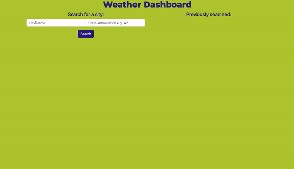

# 06 Server-Side APIs: Weather Dashboard

## User Story

```
AS A traveler
I WANT to see the weather outlook for multiple cities
SO THAT I can plan a trip accordingly
```

## Description

This application is a weather dashboard that allows users to view weather conditions for a given city. When the user enters a city and state, the application presents the temperature, humidity, and wind speed for the current day, and a 5-day forecast. The user's searched cities are also saved to local storage and displayed on a dynamically-updating list. The previously searched cities are clickable elements that will pull up the weather conditions for that city once again.

## Mock-Up

The following animation shows the web application's appearance and functionality:



## Deployment

The application is deployed at: https://kirstynrowen.github.io/weather-dashboard/

---
